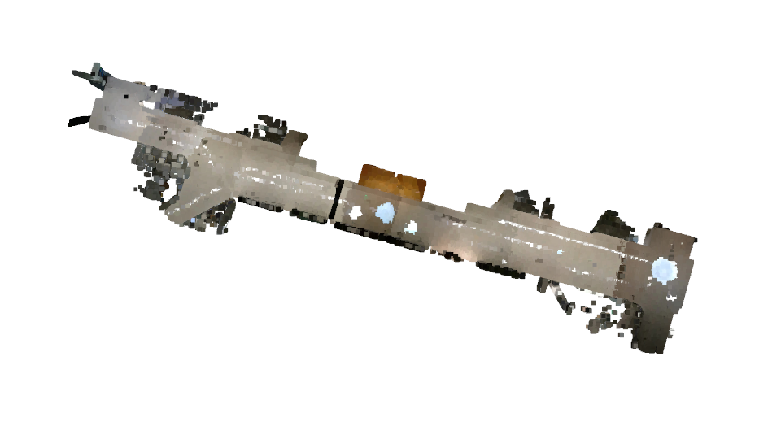
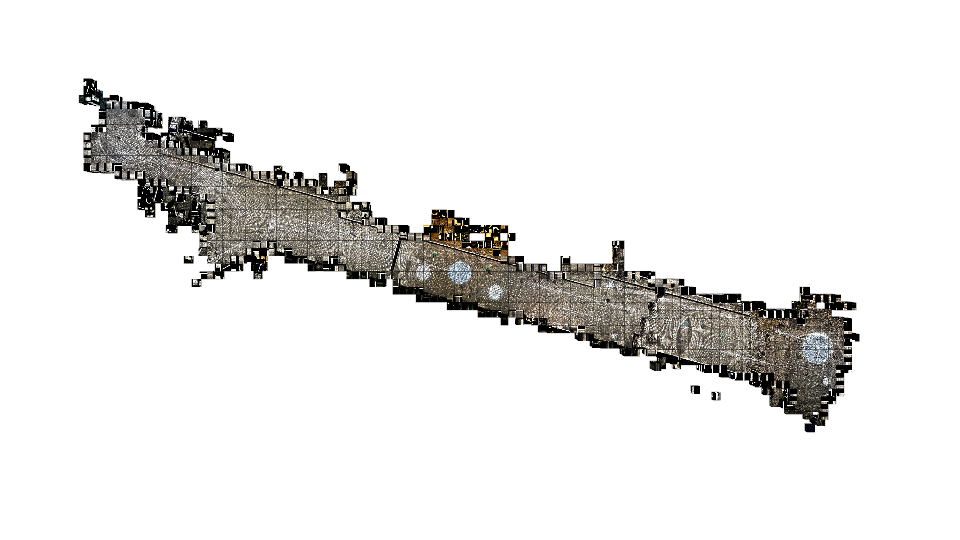
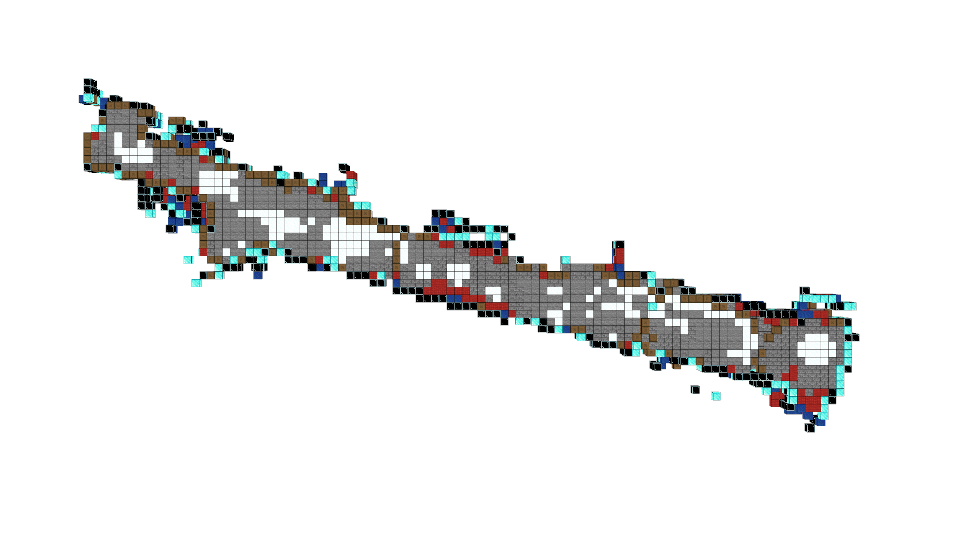

# CuTe (Cube with Texture)

A simple tool to turn **dense colorized** point cloud to Minecaft-style cubes, i.e. point cloud voxelization using Cube with Textures. 







The program reads a dense colorized point cloud, voxelize it while storing points in a CuTe. Then all points in one CuTe are rasterized to its 3 surfaces. The  surface with the largest projected alpha will be the primary surface of the CuTe. The texture of the primary surface will be the texture of the CuTe. Then, all textures are clustered into several labels using K-means algorithm. A simple color histogram based feature extractor is used to process texture images for K-means clustering. The user could provide a texture lib to specific the initial clustering centers. The user could also use another more detailed texture lib when render the CuTes.

## Dependency

```
pip install -r requirements.txt
```

## Run

```
python main.py --config config/config.yaml
```

This will run all the processing, inclusing voxelization & rasterization, clustering, and rendering.

## Explanation

A typical config file is located at `config/config.yaml`. Run
```
python main.py --help
````
to see more details.

### Voxelization & Rasterization

```
python main.py --RAST_ONLY --VISUALIZE
````
The output will store in `data/<exp_name>/cube_<cube_size>/*<texture_size>`

The `sid<texture_size>.npy` is the numpy array of primary surface id.


### Clustering

```
python main.py --RAST_ONLY --VISUALIZE
````
The clustering label will store in `data/<exp_name>/cube_<cube_size>/label<texture_size>`

### Rendering
```
python main.py --RENDER--ONLY 
````

The result with flag `RENDER_RAST` is the second image above.

## To Improve

1. A better point rasterization weighting scheme (file `cute_rasterization.py`)
2. A better texture image feature extractor (file `cute_cluster.py`)
3. A way to make use of the rasterized alpha data for each cuTe.
4. A more comprehensive texture lib

## Credits

This repo heavily depends on [Open3D](https://github.com/isl-org/Open3D).

Thanks to the textures from [KygekDev/default-textures](https://github.com/KygekDev/default-textures).